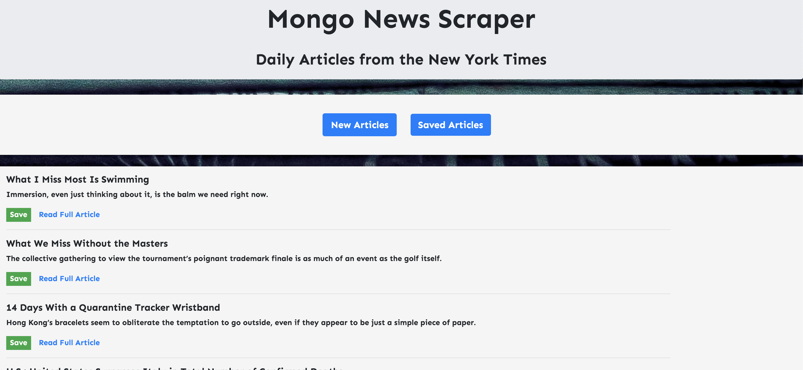
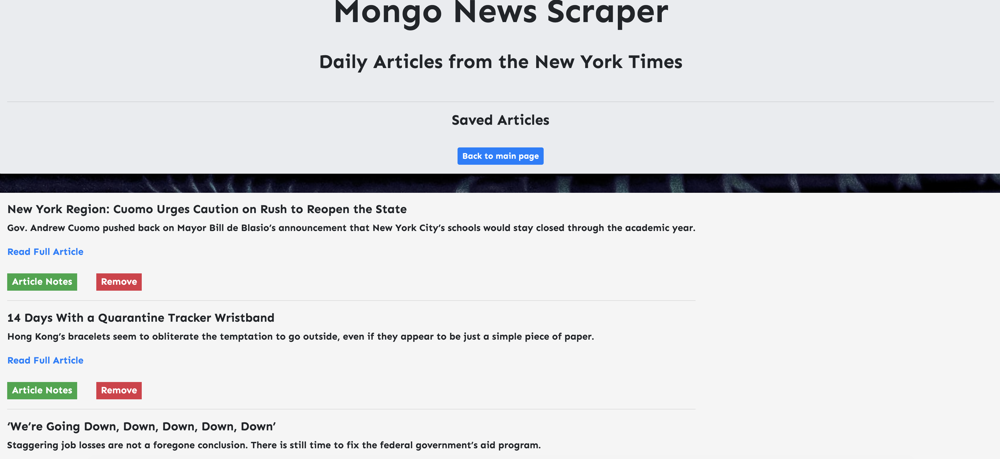
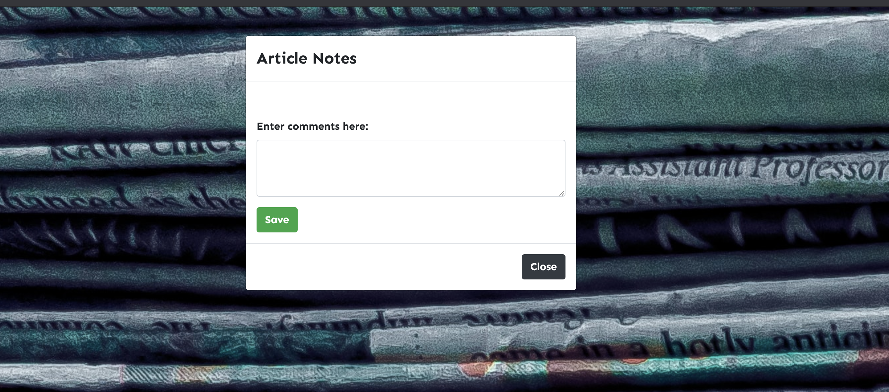

# Mongo News Scraper

## Overview

This application scrapes the New York Times website for news articles and saves them to a Mongo database. When the user launches the web application, articles from the db are appended to the page. 

Users can scrape for new articles which then save to the db as well. Users can save articles which appear in a separate page and then users can comment/leave notes.

Ex: 

## Tech Spec

This application was built with JavaScript, jQuery, HTML, CSS, and Bootstrap.

This application requires an install of the following:
 
 - Express
 - Mongoose
 - Axios
 - Cheerio

## Deploy

This application can be found deployed on Heroku : 
